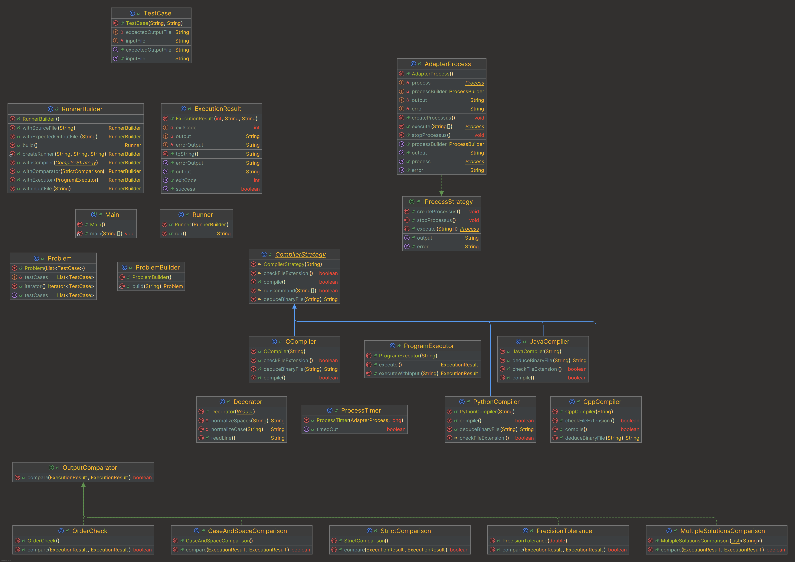

# 📦 Installation and Usage 

## 📌 Dependencies

### You need to have the following dependencies installed:
- 📦 `g++` to compile C++ testfiles
- 📦 `gcc` to compile C testfiles
- 🐍 `python3` to run python testfiles
- ☕ `javac` to compile Java testfiles
- ☕ `java` at least `version 21` to compile the testing framework
## 🛠️ Installation

```bash
git clone https://gitlab.univ-artois.fr/lucas_perez/lensjudge.git
chmod +x install.sh
./install.sh
```

## 🚀 Usage

```bash
$ lensjudge
lensjudge <sourceFile> <test.in> <test.ans>  # For a single test
lensjudge <sourceFile> <test-dir>            # For a directory of tests
```

## 📚 Example

```bash
$ lensjudge main.cc test.in test.ans
# Check if the output of main.cc is correct for test.in
```
```bash
$ lensjudge main.cc test-dir
# Check if the output of main.cc is correct for all tests in test-dir
```

## 📝 Note

- The installation script will install the `lensjudge` command in `~/bin/` since the IUT computers does not have sudo right to copy a file into `/usr/local/bin`.

# 📊 Diagrams of the project

- You can check the plantuml code in the `plantuml/lensjudge.plantuml` directory

# 📝 Task distribution

| Feature                                  | Author(s)                       |
|-------------------------------------------------|---------------------------------|
| Test case representation                  | Alexandre                       |
| Problem representation                    | Lucas                           |
| Problem configuration                     | Lucas                           |
| Process representation                   | Nathan et Enzo                  |
| Execution time limit for a process  | Nathan et Enzo                  |
| Memory limit for a process         | Nathan et Enzo                  |
| C program compilation                    | Alexandre                       |
| C++ program compilation                  | Lucas                           |
| Java program compilation                 | Enzo                            |
| Python program compilation               | Nathan                          |
| Execution of a compiled C program              | Lucas                           |
| Execution of a compiled C++ program            | Lucas                           |
| Execution of a compiled Java program           | Lucas                           |
| Strict solution verification             | Lucas                           |
| Verification with tolerance on real numbers       | Nathan                          |
| Verification with tolerance on case sensitivity        | Alexandre                       |
| Verification with tolerance on spaces     | Alexandre                       |
| Verification with tolerance on order         | Enzo                            |
| Verification of one solution among many     | Lucas                           |
| Verification delegated to an external program    | None                         |
| Execution configuration for a test case | Lucas, Nathan, Enzo et Alexandre|
| Main program of the automatic judge          | Lucas, Nathan, Enzo et Alexandre|

# 🤖 IA usage justification
Throughout this project, artificial intelligence was an essential tool for a number of reasons, including documentation, testing and technical support.

Firstly, AI was used for writing documentation. Thanks to rapid suggestions and rewording, it was possible to structure and clarify the technical and functional content of the project efficiently. AI also helped to make the documentation more accessible, by suggesting appropriate wording for each target audience, which contributed to the overall quality of the project presentation.

Secondly, AI played an important role in testing. By generating ideas for test scenarios, it made it possible to explore edge cases and validate various project functionalities. AI was also used to generate realistic input data examples to simulate different use cases and ensure that the application met expectations in terms of performance and reliability.

Finally, AI served as a technical assistant throughout the project. Whether it was development advice, code corrections or finding solutions to complex technical problems, AI accelerated the development process and enabled me to adopt more optimal approaches. By guiding and proposing appropriate solutions, AI greatly facilitated development and enabled me to concentrate on the creative aspects of the project.

In short, the use of AI has been invaluable in automating certain tasks, improving code quality and ensuring a high level of quality and clarity in the project.

# 📚 Libraries usage justification

JUnit 5 (Jupiter): Used to write and execute unit tests in Java.

JUnit assertions: provide methods for verifying test results. Assertions are used to validate the conditions expected in tests, guaranteeing that the code works as expected.

Java IO: Used for file manipulation (creation, writing, etc.). The Java IO library is essential for input/output operations, such as reading and writing files, which is crucial for tests involving scripts or data files.

System Property: Used to obtain the system's temporary directory. This allows temporary files to be created in an appropriate location, ensuring that tests do not affect the main file system.